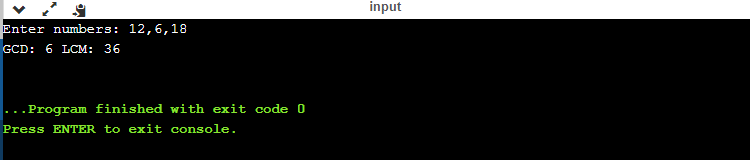

# GCD and LCM Calculator
This calculator quickly computes Greatest Common Divisor (GCD) and Least Common Multiple (LCM) for given set of numbers.

## Using
The calculator is programmed in Java. You have to have Java compiler. If not, you may use online compiler. Also the calculator uses `java.util` package to get user input.

**Sample, e.g.:**

_Enter numbers:_ 12,6,18 (The numbers must be separated by comma.)

_Output:_

GCD: 6 LCM: 36

**Screenshot**

